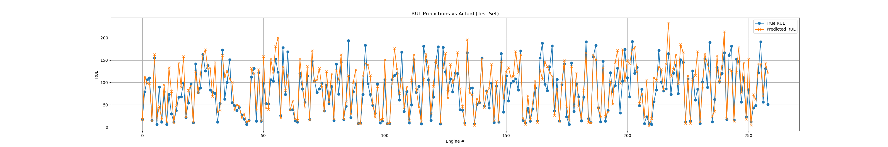

# 🚀 Remaining Useful Life Prediction (NASA C-MAPSS)
This project uses the NASA C-MAPSS turbofan engine dataset to predict Remaining Useful Life (RUL) of engines based on sensor readings. RUL prediction is a key part of predictive maintenance in aerospace and manufacturing.

## Problem Statement
Given time-series sensor data from hundreds of engines, the goal is to build a model that can predict how many cycles are left before an engine fails — using only the latest available sensor reading for each engine.

## Dataset
Source: NASA C-MAPSS Dataset

Used subset: FD002 (multiple operating conditions, 1 fault mode)

### Files:

train_FD002.txt — full engine histories until failure

test_FD002.txt — engine data up to an unknown cycle

RUL_FD002.txt — true RULs for each engine in the test set

## Methodology
### Preprocessing:

Assigned column names based on dataset documentation

Computed RUL as:
RUL = max(cycle per engine) - current cycle

Used only last row per engine for real-world prediction simulation

### Modeling:

Trained a RandomForestRegressor on sensor + setting data

Dropped ID/time columns during training

Evaluated on both internal validation and true test set

### Evaluation:

MAE (Mean Absolute Error): 23.28

RMSE (Root Mean Squared Error): 31.54

Plotted predicted vs. actual RULs for visual analysis

# 📊 Results

The model accurately captures the degradation pattern across engines with reasonable error margins, showing its potential for real-world predictive maintenance applications.

# 📈 Next Steps
Drop constant or irrelevant sensors

Engineer time-window features (e.g., rolling means)

Try boosting models (e.g., XGBoost, LightGBM)

Build a Streamlit dashboard to demo the model

# 💻 Tech Stack
Python, pandas, matplotlib, scikit-learn

Jupyter Notebook for analysis

Dataset split by engine for realistic evaluation

